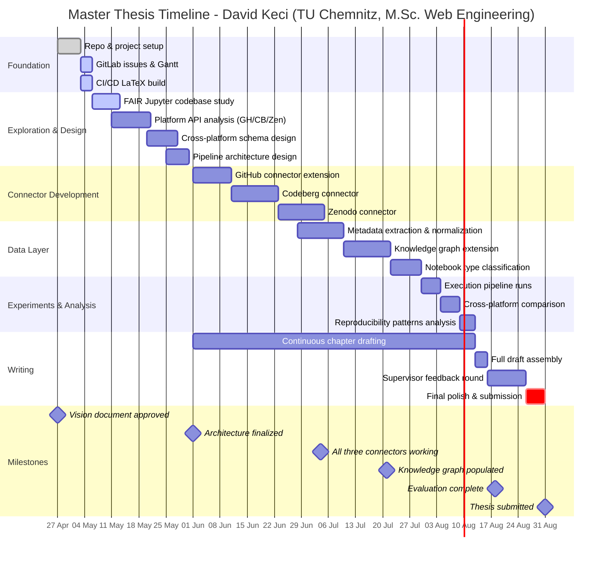

```mermaid
gantt
    title Master Thesis Timeline - David Keci (TU Chemnitz, M.Sc. Web Engineering)
    dateFormat YYYY-MM-DD
    axisFormat %d %b
    tickInterval 1week
    weekday monday

    section Foundation
    Repo & project setup           :done,   f1, 2026-04-27, 6d
    GitLab issues & Gantt          :active,   f2, 2026-05-03, 3d
    CI/CD LaTeX build              :active,   f3, 2026-05-03, 3d

    section Exploration & Design
    FAIR Jupyter codebase study         :active, r1, 2026-05-06, 7d
    Platform API analysis (GH/CB/Zen)   :        r2, 2026-05-11, 10d
    Cross-platform schema design        :        r3, 2026-05-20, 8d
    Pipeline architecture design        :        r4, 2026-05-25, 6d

    section Connector Development
    GitHub connector extension          :        c1, 2026-06-01, 10d
    Codeberg connector                  :        c2, after c1, 12d
    Zenodo connector                    :        c3, after c2, 12d

    section Data Layer
    Metadata extraction & normalization :        d1, 2026-06-28, 12d
    Knowledge graph extension           :        d2, after d1, 12d
    Notebook type classification        :        d3, after d2, 8d

    section Experiments & Analysis
    Execution pipeline runs             :        x1, after d3, 5d
    Cross-platform comparison           :        x2, after x1, 5d
    Reproducibility patterns analysis   :        x3, after x2, 4d

    section Writing
    Continuous chapter drafting         :        w1, 2026-06-01, 73d
    Full draft assembly                 :        w2, after x3, 3d
    Supervisor feedback round           :        w3, after w2, 10d
    Final polish & submission           :crit,   w4, after w3, 5d

    section Milestones
    Vision document approved            :milestone, m1, 2026-04-27, 0d
    Architecture finalized              :milestone, m2, 2026-06-01, 0d
    All three connectors working        :milestone, m3, 2026-07-04, 0d
    Knowledge graph populated           :milestone, m4, 2026-07-21, 0d
    Evaluation complete                 :milestone, m5, 2026-08-18, 0d
    Thesis submitted                    :milestone, m6, 2026-08-31, 0d
```